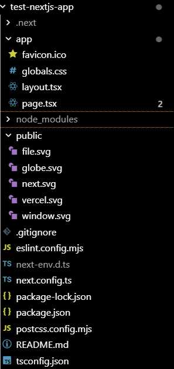

# Introduction to Next.js

With a solid foundation in TypeScript now established, let's build an application in Next.js!  Next.js is a framework that's a superset of the React framework, except that it provides more support for building full-stack web applications.  Next.js allows you to create dedicated server and client components to handle front-end and back-end logic, and there a ton of built-in optimizations that allow the app to scale and run quickly and smoothly.

## Starting a new Next.js project
There are a couple of ways to create a new Next.js project.  In order to get started, you must have Node.js installed on your machine.

If you use the npm package manager, run the following command:
```
npx create-next-app@latest your-app-name-here
```
This will install the `create-next-app` package.  Go ahead and type `Y` to proceed.  From there you will be prompted if you want to use the recommended defaults for Next.js.  By default, you will have TypeScript, Tailwind and other packages and tools like ESLint, App Router, and Turbopack.  Otherwise you can configure the set-up yourself.  To bypass the prompts, do the following and use the built-in defaults or the defaults you set up yourself:
```
npx create-next-app@latest your-app-name-here --yes
```

Alternately you can install a separate package manager called `pnpm`:
```
npm install -g pnpm
```
The `pnpm` package manager is faster than npm as it uses caching and symbolic links to speed installations along.  

Once you install pnpm, you can create a Next.js app like so:
```
pnpm create next-app@latest your-app-name-here --yes
```
The defaults are the same regardless of which package manager you use.

## Starting and running the app
Make sure once you create the project that you enter the folder - which will have the same name as your project - by running `cd your-project-name-here`, changing the name appropriately.  To run your project, type `npm run dev` or `pnpm dev`.

To see the project in action, go to `localhost:3000`.  (You can configure the port number yourself to a different one.)

To stop the project, run `Ctrl`+`C` or `Cmd`+`C`.

## Folder structure
Inside your project, you will have files and folders that look like this:



Like in a React project, you will have a `package.json` file that contains the scripts and packages for your project.  You will also recognize the `tsconfig.json` file for TypeScript projects.

The `app` folder is a starter folder that contains your CSS and tsx files.  The important file we'll start with is the `page.tsx` file, which is the home page for your project.  We'll learn how to organize our CSS files and routes very soon!

The `public` folder houses all your static content, so images, videos, etc.

You can find out more about how Next.js projects are organized, along with folder and file conventions, at https://nextjs.org/docs/app/getting-started/project-structure.

## Routing
Talk about path variables, routing and setting up page.tsx files

## CSS
Talk about linking CSS files and modules here